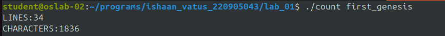

# LAB NO: 1 - BASIC FILE HANDLING OPERATIONS
## Ishaan Vatus, CSE-D, Roll No. 10, 220905043

1. To count the number of lines and characters in a file

### INPUT

```txt
Bible, King James Version
Genesis
Gen.1
[1] In the beginning God created the heaven and the earth
[2] And the earth was without form, and void; and darknes
[3] And God said, Let there be light: and there was light
[4] And God saw the light, that it was good: and God divi
[5] And God called the light Day, and the darkness he cal
[6] And God said, Let there be a firmament in the midst o
[7] And God made the firmament, and divided the waters wh
[8] And God called the firmament Heaven. And the evening 
[9] And God said, Let the waters under the heaven be gath
[10] And God called the dry land Earth; and the gathering
[11] And God said, Let the earth bring forth grass, the h
[12] And the earth brought forth grass, and herb yielding
[13] And the evening and the morning were the third day.
[14] And God said, Let there be lights in the firmament o
[15] And let them be for lights in the firmament of the h
[16] And God made two great lights; the greater light to 
[17] And God set them in the firmament of the heaven to g
[18] And to rule over the day and over the night, and to 
[19] And the evening and the morning were the fourth day.
[20] And God said, Let the waters bring forth abundantly 
[21] And God created great whales, and every living creat
[22] And God blessed them, saying, Be fruitful, and multi
[23] And the evening and the morning were the fifth day.
[24] And God said, Let the earth bring forth the living c
[25] And God made the beast of the earth after his kind, 
[26] And God said, Let us make man in our image, after ou
[27] So God created man in his own image, in the image of
[28] And God blessed them, and God said unto them, Be fru
[29] And God said, Behold, I have given you every herb be
[30] And to every beast of the earth, and to every fowl o
[31] And God saw every thing that he had made, and, behol
```

### CODE

```c
#include <stdio.h>
int main(int argc, char **argv)
{
	FILE *fp = fopen(argv[1], "r");
	FILE *san = fopen("sanitized", "w");
	char ch;
	int lines = 0, chars = 0;
	while ((ch = fgetc(fp)) != EOF) {
		chars++;
		if (ch == '\n') {
			lines++;
		}
	}
	printf("LINES:%d\nCHARACTERS:%d\n", lines, chars);
}
```

2. To reverse the file contents and store in another file. Also display the size of file using file handling function

### INPUT

```txt
racecar palindromes recaps rats semordnilap
```

### CODE

```c
#include <stdio.h>
int main(int argc, char **argv) 
{
	FILE *fp = fopen(argv[1], "r");
	FILE *rv = fopen("reversed", "w");
	int chars = 0;
	char ch;
	while ((ch = getc(fp)) != EOF) {
		chars++;
	}
	while (chars > 0) {
		fseek(fp, -1, SEEK_CUR); // read backwards
		ch = getc(fp);
		fseek(fp, -1, SEEK_CUR); // fix offset
		putc(ch, rv);
		chars--;
	}

}
```

3. That merges lines alternatively from 2 files and stores it in a resultant file.

### INPUT (file1)

```txt
1hello
2hello
3hello
4hello
5hello
6hello
```

### INPUT (file2)

```txt
1bye
2bye
3bye
4bye
5bye
6bye
7bye
8bye
```

### CODE

```c
#include <stdio.h>
int main(int argc, char **argv) 
{
	FILE *src0 = fopen(argv[1], "r");
	FILE *src1 = fopen(argv[2], "r");
	FILE *dst = fopen("spliced", "w");
	char ch;
	int flag = 0;
	int ended = -1;
	while (1) {
		if (flag) {
			ch = getc(src1);
			if (ch == EOF) {
				ended = 1;
				break;
			}
			else if (ch == '\n') {
				fputc(ch, dst);
				flag = !flag;
				continue;
			}
			else
				fputc(ch, dst);
		}
		else {
			ch = getc(src0);
			if (ch == EOF) {
				ended = 0;
				break;
			}
			else if (ch == '\n') {
				fputc(ch, dst);
				flag = !flag;
				continue;
			}
			else
				fputc(ch, dst);
		}
	}
	if (ended == 1) {
		while ((ch = getc(src0)) != EOF)
			putc(ch, dst);
	}
	else if (ended == 0) {
		while ((ch = getc(src1)) != EOF)
			putc(ch, dst);
	}
}
```

4. That accepts an input statement, identifies the verbs present in them and performs the following
functions

a. INSERT: Used to insert a verb into the hash table.
- Syntax: insert (char *str)


b. SEARCH: Used to search for a key(verb) in the hash table. This function is called by INSERT
function. If the symbol table already contains an entry for the verb to be inserted, then it returns
the hash value of the respective verb. If a verb is not found, the function returns -1.
- Syntax: int search (key)

### CODE

```c
```
